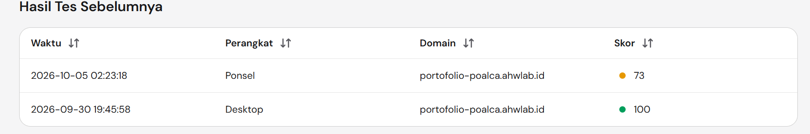

# Poalca Valusio - Full Stack Software Engineer Portfolio



A modern, high-performance, and fully responsive bilingual (English/Indonesian) portfolio built to showcase my projects, professional experience, and technical skills. 

Live at: **[portofolio-poalca.ahwlab.id](https://portofolio-poalca.ahwlab.id)**

## Tech Stack

- **Framework:** Next.js 15 (App Router, Static Export)
- **Styling:** Tailwind CSS v4
- **Animations:** Framer Motion
- **Icons:** Lucide React
- **Forms:** Formspree (Client-side)
- **Deployment:** Hostinger via GitHub Actions (CI/CD)

## Features

-  **Internationalization (i18n):** Native bilingual support (EN/ID) without third-party dependencies, optimized for static export.
-  **High Performance:** Achieves 95+ Lighthouse scores utilizing Next.js static generation (SSG) and priority asset fetching.
-  **Modern Design:** Glassmorphism UI, smooth scroll animations, and CSS-based responsive layouts.
-  **Mobile First:** Fully responsive across all devices from small smartphones to ultrawide monitors.
-  **Serverless Contact Form:** Integrated with Formspree for seamless and secure email forwarding.
-  **CI/CD Pipeline:** Fully automated deployment to Shared Hosting via GitHub Actions.

## Local Development

### Prerequisites
- Node.js >= 20
- npm >= 10

### Setup
1. Clone the repository
```bash
git clone https://github.com/valusio/Porto-Poal.git
cd Porto-Poal
```

2. Install dependencies
```bash
npm install
```

3. Configure Environment
Create a `.env.local` file in the root directory:
```env
NEXT_PUBLIC_FORMSPREE_URL=your_formspree_endpoint
```

4. Run the development server
```bash
npm run dev
```
Visit `http://localhost:3000` to view the application.

##  Deployment (Static Export)

This project uses Next.js `output: 'export'` for maximum performance and cost-efficiency.

```bash
npm run build
```
The compiled output will be generated in the `out/` directory, ready to be served by any static file host like Nginx, Apache, or AWS S3.

##  License
This project is proprietary and intended as a personal portfolio.
